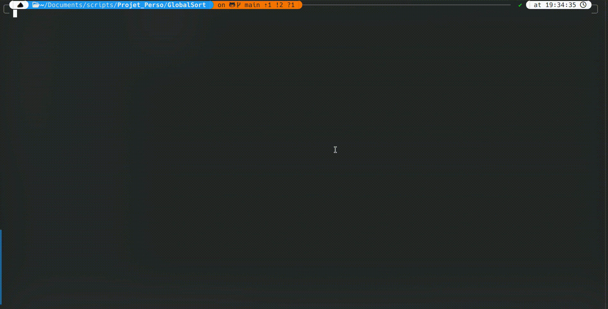

# 🌍 GlobalSort

[](placeholder)
[](https://github.com/recule556688/Projet_Perso/issues)
[](https://github.com/recule556688/Projet_Perso/blob/main/LICENSE)

[](https://app.deepsource.com/gh/recule556688/Projet_Perso/)
[](https://app.deepsource.com/gh/recule556688/Projet_Perso/)

---

## 🗂️ GlobalSort is a Python-based utility tool designed to organize files in your computer's directories

## 📚 Table of Contents

- [📘 About](#-about)
- [🏁 Getting Started](#-getting-started)
- [⭐ Features](#-features)
- [🔌 Supported Extensions](#-supported-extensions)
- [🌍 Supported Languages](#-supported-languages)
- [💿 Installation](#-installation)
- [🖥️ Usage](#usage)
- [📜 License](#-license)

## 📖 About

- "GlobalSort is my first project developed in Python. I decided to create this powerful file organization tool as a means to learn Python and simultaneously find a solution to organize my files efficiently."

## ⭐ Features

### GlobalSort automatically updates at launch to ensure you always have the latest features and improvements

#### The tool provides a menu with the following options

- Sort music files
- Sort video files
- Sort image files
- Sort document files
- Sort download files
- Sort files from a specific directory
- Sort all directories
- Edit the folders of the sorting program
- Edit the extensions of the sorting program
- Undo last operation
- Display the help menu
- Quit the program

## 🚀 Getting Started

- These instructions will guide you through the process of setting up and running the GlobalSort
    project on your local machine.

## 🔌 Supported Extensions

### 🎵 Music

- .mp3, .wav, .flac, .ogg, .wma, .m4a, .aac, .aiff, .ape

### 🎥 Video

- .mp4, .avi, .gif, .mkv, .wmv, .mov

### 🖼️ Image

- .bmp, .png, .jpg, .jpeg, .heic, .svg

### 📄 Document

- .txt, .pptx, .csv, .xls, .odp, .pages, .pdf, .doc, .zip, .docx

### 📥 Download

- All the extensions mentioned above and:

    .exe, .bat, .sh, .py, .pyw, .msi, .apk, .app, .deb, .rpm, .bin, .dmg, .run, .jar

### 📂 And now folders customisable by the user

- With the new update, you can now add your own folders to the program.

  - To do so, simply select option `8` in the main menu and follow the instructions. You can add as many folders as you want and they will be saved in a file called "folders.json" in the "User_files" folder. The program will then read the file and add the folders to the list of folders to sort.

### 🛠️ And now extensions customisable by the user

- With the new update, you can now add your own extensions to the program.

  - To do so, simply select option `9` in the main menu and follow the instructions. You can add as many extensions as you want and they will be saved in a file called "extensions.json" in the "User_files" folder. The program will then read the file and add the extensions to the list of extensions to sort.

## 🌍 Supported Languages

### The program currently supports the following languages

#### the languages is automatically detected by the system and the program will display the language in the corresponding language your system is set to and if the language is not supported the program will display in English

- us English
- 🇫🇷 French
- 🇪🇸 Spanish
- 🇩🇪 German
- 🇮🇹 Italian
- 🇷🇺 Russian

## 💿 Installation

### Prerequisites

- You have installed [Git](https://git-scm.com/downloads).
- You have installed Python. You can download it from the [official website](https://www.python.org/downloads/).

### Installation Steps

1. Clone the repository to your local machine:

    ```bash
    git clone https://github.com/recule556688/Projet_Perso.git
    ```

2. Navigate to the project's directory:

    ```bash
    cd GlobalSort
    ```

3. Create a virtual environment:

    ```bash
    python -m venv venv
    ```

    - On Windows:

        ```bash
        .\venv\Scripts\activate
        ```

    - On MacOS and Linux:

        ```bash
        source venv/bin/activate
        ```

4. Install the required packages:

    ```bash
    pip install -r requirements.txt
    ```

5. Run the program:

    ```py
    python GlobalSort.py
    ```

## 🖥️ Usage

1. Run the program:

    ```bash
    python GlobalSort.py
    ```

2. Sorting Files:

   - Select an option from the menu (e.g., `2` for sorting video files).
   - The program will automatically move the files into the corresponding directories.

3. Adding Custom Folders or Extensions:

   - Use option `8` to add a new folder that you want to sort.
   - Use option `9` to add a new file extension to be recognized by the program.

4. Undoing Actions:

   - If you need to revert the last sorting action, use option `10` to undo the changes.



## 📜 License

This project is under license from MIT. For more details, see the [LICENSE](LICENSE) file.

Made with ❤️ by [Karma](https://github.com/recule556688)

[Back to top](#top)
